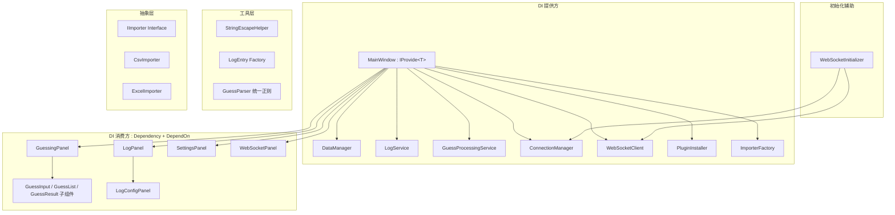

## 产品概述

对 AutoCMEX 项目进行系统性结构优化，消除类职责越界、统一 DI 注入方式、拆分 God Object、提取工具类与抽象层，全面提升代码可维护性与可测试性。

## 核心优化目标

### 类职责归位（11项）

- **AiFuzzifier**：移除未使用的 `_bosses` 字段及构造函数参数
- **InMemoryLogWriter**：将 `ParseFormatted` 字符串解析逻辑提取到 `LogEntry` 静态工厂方法
- **LogService/ILogService**：移除空占位的 `Flush()` 方法
- **DataManager**：`CloneSettingsForSave` 从手动逐属性拷贝改为 JSON 序列化-反序列化
- **GuessParser/GuessPipeline**：合并重复的 `PairRegex`/`PairPattern` 正则定义，统一到 GuessParser
- **GuessProcessingService**：合并 `ProcessManualAsync`/`ProcessManagedAsync` 为单一方法，filterMode 从设置读取，移除 currentBoss 参数，Error 由调用方各自处理
- **ConnectionManager**：统一 `SendMessageAsync` 和 `SendMessage` 双重发送路径为单一异步路径
- **CsvImporter/ExcelImporter**：提取 `IImporter` 接口 + `ImporterFactory` 工厂模式

### UI 层职责分离（10项）

- **GuessingPanel**：提取 `EscapeCsv` 到 `StringEscapeHelper` 工具类；`OnProcessGuess` 改用 DI 注入服务；拆分 877 行巨型面板为多个子组件
- **LogPanel**：提取 `EscapeBbcode` 到 `StringEscapeHelper`；分离日志配置管理为独立 `LogConfigPanel`
- **SettingsPanel**：提取 `CopyPluginDir` 到 `PluginInstaller` 服务类；`TestModelConnection` 改用 `AiServiceFactory.CreateService`
- **MainWindow**：`BuildClientUrl` 移到 `WebSocketClient`；移除 DI 容器职责，拆分服务编排逻辑；消除 `OnReady` 与 `RestartWebSocket` 中重复的 WebSocket 初始化代码
- **WebSocketPanel**：将 `System.Timers.Timer` 替换为 Godot 原生 `Timer` 节点

### 架构统一（3项）

- **DI 注入方式统一**：消除 `AppLogs.Current` 静态获取、`SetServer()` 手动注入等非标准方式，统一使用 Chickensoft.AutoInject 的 `IProvide<T>` + `Provide()`（提供方）/ `[Dependency]` + `DependOn<T>()`（消费方）配套模式
- **MainWindow God Object 分解**：剥离 WebSocket 初始化、URL 构造等非 DI 职责到独立类（`WebSocketInitializer`），MainWindow 保留 DI 提供方 + UI 窗口管理职责
- **GuessingPanel 数据同步**：手动刷新 UI 改为 `ObservableCollection` 自动触发 UI 更新

## 技术栈

- **语言**：C# (.NET 8)
- **引擎**：Godot 4.x (Mono)
- **测试框架**：xUnit / NUnit（沿用现有测试框架）
- **序列化**：System.Text.Json（用于 CloneSettingsForSave）

## 实现方案

### 整体策略

采用**渐进式重构**策略，按依赖关系自底向上分 5 个批次执行：核心层清理 → 抽象层提取 → UI 工具类提取 → UI 面板拆分 → DI 与架构统一。每批次独立可验证，降低回归风险。

### 关键技术决策

1. **ParseFormatted 提取方式**：在 `LogEntry` 上新增 `static LogEntry FromFormattedString(string formatted)` 工厂方法，将解析逻辑从 `InMemoryLogWriter` 移出，符合"数据解析属于数据模型"原则。

2. **CloneSettingsForSave 改用 JSON**：`AppSettings` 是 POCO 类，JSON 序列化-反序列化深拷贝比手动逐属性赋值更简洁且自动适应属性增减。性能开销可忽略（仅在保存配置时调用，非热路径）。

3. **GuessProcessingService 合并**：`ProcessManualAsync` 和 `ProcessManagedAsync` 的核心差异仅为 filterMode（应从 `AppSettings` 读取）和 currentBoss（调用方已知，无需传入）。合并后签名：`Task<GuessProcessingResult> ProcessAsync(string content, string bossName)`，filterMode 内部从 IDataManager 读取，Error 由调用方自行判断 result.Success。

4. **ConnectionManager 发送统一**：当前 `SendMessageAsync` 调用 `_client.SendAsync`，`SendMessage` 调用 `_server.Send`。统一为 `SendMessageAsync`，内部根据连接状态选择 client/server 发送路径，消除调用方困惑。

5. **DI 统一方案**：保留 Chickensoft.AutoInject 的 `IProvide<T>` + `Provide()` / `[Dependency]` + `DependOn<T>()` 配套模式作为唯一 DI 方式。消除非标准注入路径：`LogPanel` 中的 `AppLogs.Current` 静态获取改为 `[Dependency]` 声明 + `DependOn` 解析；`WebSocketPanel` 中的 `SetServer()` 手动注入改为 `[Dependency]` 声明。MainWindow 继续作为 DI 提供方（`IProvide<T>`），但剥离 WebSocket 初始化等非 DI 编排逻辑。

6. **MainWindow 分解**：剥离 WebSocket 初始化、URL 构造等非 DI 编排职责到独立类（`WebSocketInitializer`），消除 OnReady/RestartWebSocket 重复。MainWindow 保留 DI 提供方（`IProvide<T>`）+ UI 窗口管理职责。

7. **ObservableList 集成**：使用 `ObservableCollection<T>` 替代 `List<T>` 作为 DataManager 的猜词列表容器，GuessingPanel 绑定 `CollectionChanged` 事件自动刷新 UI，消除手动 `RefreshGuessList()` 调用。

### 架构设计



### 目录结构

```
src/
├── core/
│   ├── ai/
│   │   ├── AiFuzzifier.cs          # [MODIFY] 移除 _bosses 字段和构造函数参数
│   │   └── AiServiceFactory.cs     # [MODIFY] 保持不变，SettingsPanel 将使用它
│   ├── guessing/
│   │   ├── GuessParser.cs          # [MODIFY] 保留 PairRegex，设为 internal static 供 GuessPipeline 复用
│   │   ├── GuessPipeline.cs        # [MODIFY] 移除 PairPattern，改用 GuessParser.PairRegex
│   │   ├── GuessProcessingService.cs  # [MODIFY] 合并 ProcessManualAsync/ProcessManagedAsync 为 ProcessAsync
│   │   └── IGuessProcessingService.cs # [MODIFY] 更新接口签名
│   ├── logging/
│   │   ├── LogEntry.cs             # [MODIFY] 新增 FromFormattedString 静态工厂方法
│   │   ├── InMemoryLogWriter.cs    # [MODIFY] 移除 ParseFormatted，调用 LogEntry.FromFormattedString
│   │   ├── LogService.cs           # [MODIFY] 移除 Flush() 空方法
│   │   └── ILogService.cs          # [MODIFY] 移除 Flush() 接口声明
│   ├── storage/
│   │   ├── DataManager.cs          # [MODIFY] CloneSettingsForSave 改用 JSON 深拷贝
│   │   ├── IImporter.cs            # [NEW] 导入器抽象接口，定义 ImportAsync(string path) 方法
│   │   ├── CsvImporter.cs          # [MODIFY] 实现 IImporter 接口
│   │   ├── ExcelImporter.cs        # [MODIFY] 实现 IImporter 接口
│   │   └── ImporterFactory.cs      # [NEW] 工厂类，根据文件扩展名返回 IImporter 实例
│   └── websocket/
│       ├── ConnectionManager.cs    # [MODIFY] 移除 SendMessage，统一为 SendMessageAsync
│       ├── IConnectionManager.cs   # [MODIFY] 移除 SendMessage 接口声明
│       ├── WebSocketClient.cs      # [MODIFY] 新增 BuildClientUrl 方法（从 MainWindow 迁入）
│       └── WebSocketInitializer.cs # [NEW] WebSocket 初始化逻辑，消除 MainWindow 重复代码
├── ui/
│   ├── main/
│   │   └── MainWindow.cs           # [MODIFY] 剥离 WebSocket 初始化到 WebSocketInitializer、移除 BuildClientUrl、保留 DI 提供方职责
│   ├── guessing/
│   │   ├── GuessingPanel.cs        # [MODIFY] 移除 EscapeCsv，OnProcessGuess 改用 DI，拆分职责
│   │   ├── GuessInputSection.cs    # [NEW] 猜词输入区域子组件
│   │   └── GuessListSection.cs     # [NEW] 猜词列表显示子组件
│   ├── logging/
│   │   ├── LogPanel.cs             # [MODIFY] 移除 EscapeBbcode，分离配置管理
│   │   └── LogConfigPanel.cs       # [NEW] 日志配置独立面板
│   ├── settings/
│   │   └── SettingsPanel.cs        # [MODIFY] 移除 CopyPluginDir，TestModelConnection 改用工厂
│   └── websocket/
│       └── WebSocketPanel.cs       # [MODIFY] System.Timers.Timer → Godot Timer
├── services/
│   └── PluginInstaller.cs          # [NEW] 插件安装服务，封装 CopyPluginDir 文件系统操作
├── helpers/
│   └── StringEscapeHelper.cs       # [NEW] 字符串转义工具类，包含 EscapeCsv、EscapeBbcode
└── models/
    └── AppSettings.cs              # [MODIFY] 保持不变，JSON 深拷贝依赖其可序列化性
```

## 实现要点

### 性能考量

- **JSON 深拷贝**：仅保存配置时调用（非热路径），单次耗时 &lt;1ms，无性能影响
- **ObservableCollection**：猜词列表写入频率低（人工输入），CollectionChanged 事件开销可忽略
- **Godot Timer 替代 System.Timers.Timer**：消除跨线程调度开销，与 Godot 主循环天然同步

### 回归风险控制

- 每批次独立提交，通过 `dotnet build` + `dotnet test` 验证
- 接口变更优先，实现变更在后，确保编译期捕获错误
- 保留旧方法标记 `[Obsolete]` 过渡一个批次后再移除

### 日志规范

- 沿用项目现有 `ILogService` 日志接口
- 重构操作记录 Info 级别日志，异常记录 Error 级别
- 避免在工具类/静态方法中直接写日志，由调用方负责

## Agent Extensions

### Skill

- **task-commander**
- 用途：将本重构方案分解为依赖排序的子任务，使用 SubAgent 并行执行独立任务
- 预期结果：各批次任务按依赖顺序高效执行，独立模块并行处理，缩短整体重构周期

- **tdd**
- 用途：在修改核心业务逻辑（GuessProcessingService、ConnectionManager、DataManager）时采用红-绿-重构循环，确保行为不变
- 预期结果：每个核心修改都有对应的单元测试保护，重构前后行为一致

- **csharp-test-granularity-standard**
- 用途：规范新增和修改的测试代码颗粒度，确保测试覆盖适当分层
- 预期结果：测试代码符合项目规范，不过度测试也不遗漏关键路径

- **csharp-document-writing-standard**
- 用途：规范重构后的代码注释和项目文档更新
- 预期结果：所有修改的类和方法具备完整 XML 注释，CHANGELOG 记录变更

- **csharp-solution-output-standard**
- 用途：确保本方案输出符合项目方案规范
- 预期结果：方案可评估、可落地
